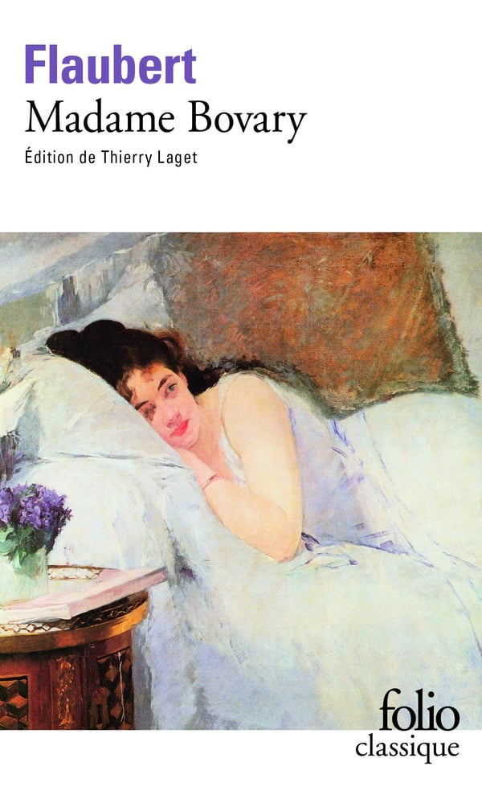
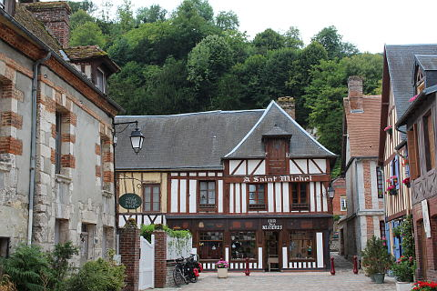
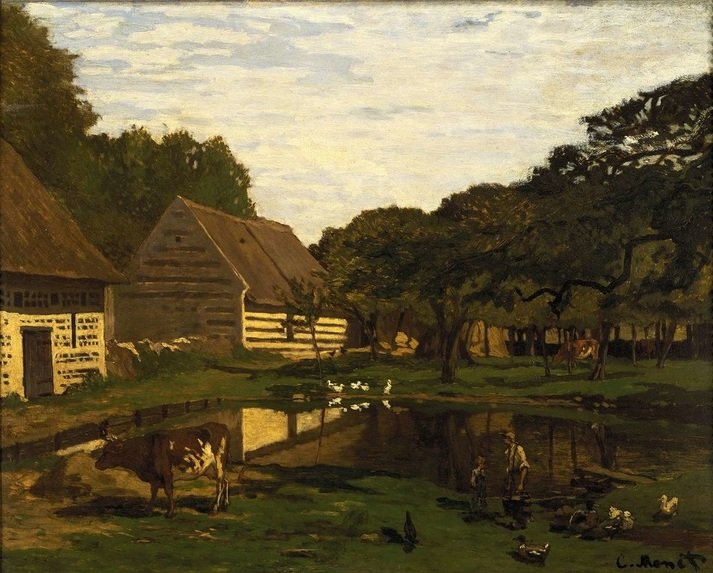
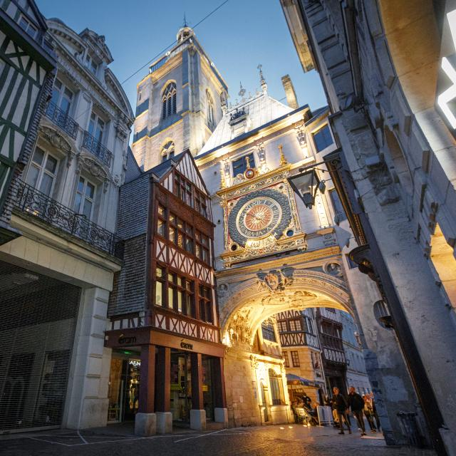
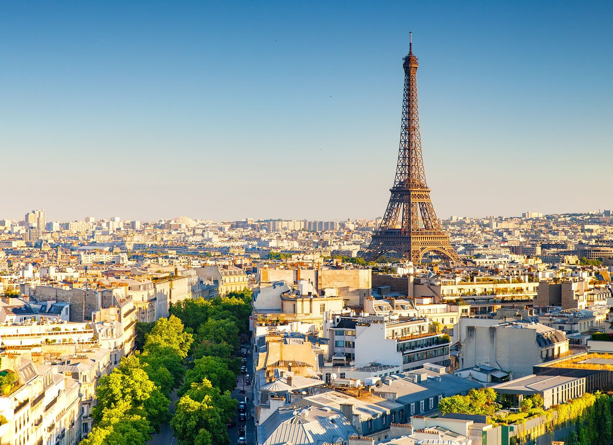
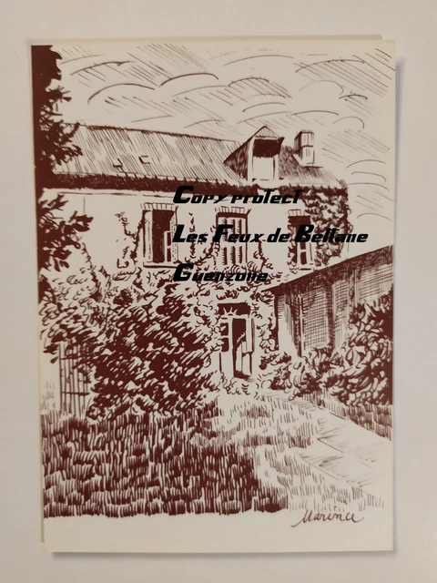

# Les lieux de l'oeuvre

Dans Madame Bovary, Gustave Flaubert montre l'évolution du personnage d'Emma ainsi que la différence entre ses rêves et la réalité à travers de nombreux lieux.

Les lieux principaux du roman sont :
1. Tostes
2. Yonville
3. Rouen
4. Paris
5. Les espaces clos

# Tostes

Tostes est le premier lieu important du roman et correspond à la vie conjugale d’Emma avec Charles. Elle y découvre rapidement une existence monotone, loin de l’image passionnée du mariage qu’elle s’était imaginée. La maison, le quotidien et les habitudes de Charles deviennent pour elle des symboles de son ennui et de son enfermement. Tostes représente donc la réalité bourgeoise et provinciale dont Emma cherche à s’échapper. C’est dans ce lieu qu’elle prend véritablement conscience du décalage entre ses rêves et sa vie réelle.

# Yonville

Après avoir quitté Tostes, Emma et Charles s’installent à Yonville-l’Abbaye. Ce village devient le principal décor du roman. Flaubert y rassemble différents personnages qui représentent la société provinciale : Homais, le pharmacien ambitieux, Lheureux, le commerçant intéressé, ou encore les habitants qui observent et commentent la vie des autres. Yonville apparaît comme un monde étroit, conformiste et dominé par les apparences. Emma espère que ce changement de lieu transformera sa vie, mais elle retrouve finalement le même ennui. Le déplacement géographique ne suffit donc pas à résoudre son mal-être.

# Rouen

Rouen représente un espace beaucoup plus animé que Tostes ou Yonville. Emma s’y rend notamment pour retrouver Léon, avec qui elle entretient une liaison. La ville devient ainsi un lieu de liberté, de passion et de transgression. Emma peut y échapper temporairement au regard de son entourage et à sa vie quotidienne. Cependant, même Rouen ne lui apporte pas le bonheur durable qu’elle recherche. Ses rencontres avec Léon finissent par devenir routinières, montrant une nouvelle fois que le changement de lieu ne suffit pas à combler son insatisfaction.

# Paris

Emma rêve également de lieux qu’elle ne connaît pas réellement, notamment Paris, qui représente pour elle une vie mondaine, élégante et passionnée. Ces lieux sont essentiellement construits par son imagination et ses lectures. Ils symbolisent un monde idéal, très éloigné de la province dans laquelle elle vit. Emma imagine Paris comme un endroit où elle pourrait enfin devenir la femme qu’elle rêve d’être. Flaubert montre ainsi que certains lieux ont une dimension imaginaire : Emma ne désire pas seulement changer de lieu, elle désire changer de vie. Ses rêves géographiques sont donc liés à son désir d’échapper à sa condition.

# Les espaces clos

La maison, les chambres et les autres espaces clos occupent également une place importante dans le roman. Ils donnent souvent une impression d’enfermement et correspondent à la situation d’Emma, qui se sent prisonnière de son mariage, de son rôle social et de sa vie provinciale. À l’inverse, les déplacements et les voyages semblent représenter la possibilité d’une nouvelle vie. Mais cette opposition entre espaces clos et espaces ouverts reste finalement trompeuse : même lorsqu’Emma change de lieu, elle emporte avec elle ses frustrations et ses illusions. Les lieux deviennent donc le reflet de son état intérieur.

[Retour aux personnages](perso.md)

[Retour aux thèmes](themes.md)

[Retour à la page principale](index.md)
