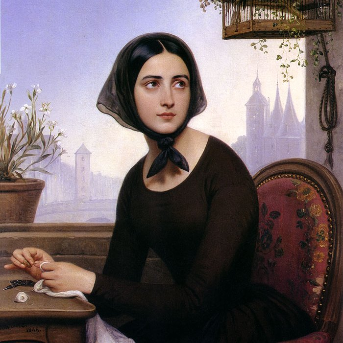
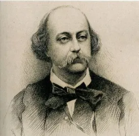
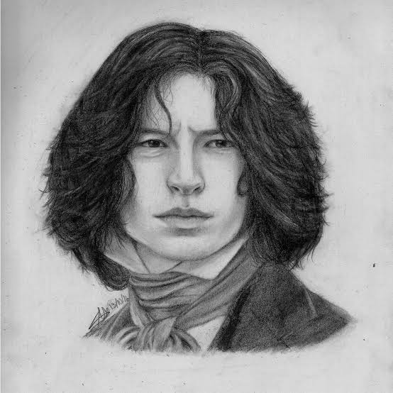
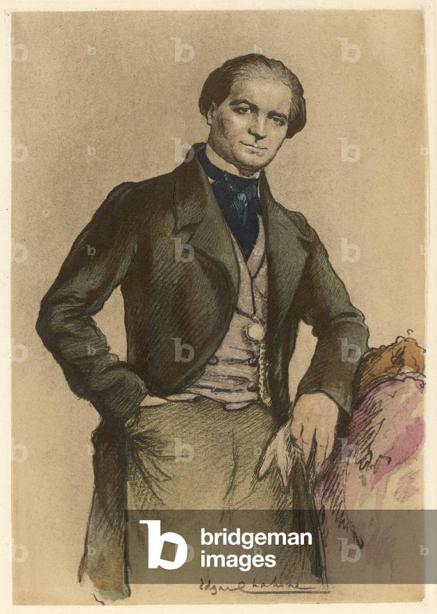

# Les personnages

Le roman comporte peu de personnages importants. Les principaux sont :

1. Emma Bovary
2. Charles Bovary
3. Léon Dupuis
4. Rodolphe Boulanger

## Emma Bovary

Emma Bovary, l’héroïne tragique du chef-d'œuvre de Gustave Flaubert publié en 1857, incarne le drame de la désillusion romantique. Élevée dans un couvent où elle se nourrit de lectures sentimentales, cette jeune femme de la campagne normande rêve de luxe, de passions ardentes et de vie mondaine. Son mariage avec Charles Bovary, un officier de santé provincial d'une affligeante banalité, la plonge rapidement dans un ennui profond et une mélancolie destructrice. Pour échapper à la monotonie de son quotidien à Yonville, Emma cherche désespérément le grand amour dans les bras de ses amants successifs, Rodolphe Boulanger puis Léon Dupuis. Cependant, ces liaisons passionnées s'avèrent décevantes et la poussent à dépenser sans compter auprès du marchand manipulateur Lheureux. Acculée par des dettes colossales qu'elle ne peut rembourser et refusant la déchéance sociale, elle choisit de mettre fin à ses jours en avalant de l'arsenic. Sa mort tragique a donné naissance au concept psychologique et littéraire du « bovarysme », caractérisé par l'insatisfaction chronique d'un individu face à une réalité incapable de rivaliser avec ses idéaux imaginaires.

## Charles Bovary

Charles Bovary, personnage central du roman de Gustave Flaubert, incarne la figure tragique de l'homme médiocre, passif et profondément dévoué. Officier de santé provincial sans grande ambition ni génie, il mène une existence routinière et monotone qui contraste violemment avec les aspirations romanesques de sa seconde épouse, Emma Rouault. Aveuglé par un amour inconditionnel et une admiration sans bornes pour elle, Charles se montre totalement incapable de percevoir le mal-être, l'ennui mortel et les infidélités successives de sa femme avec Rodolphe et Léon. Homme bon mais d'une affligeante naïveté, il ne réalise l'ampleur du désastre financier provoqué par Emma qu'au moment de sa faillite, juste avant le suicide de celle-ci à l'arsenic. Écrasé par le chagrin et découvrant la vérité sur les trahisons d'Emma après sa mort en ouvrant ses lettres secrètes, il se laisse dépérir et meurt seul dans son jardin, laissant leur jeune fille Berthe orpheline et misérable. À travers ce anti-héros touchant mais dérisoire, Flaubert dresse le portrait cinglant de la platitude bourgeoise du XIXe siècle, incapable de comprendre ou de sauver l'idéalisme romantique.

## Léon Dupuis

Léon Dupuis incarne dans le roman de Gustave Flaubert la figure du jeune provincial timide qui partage initialement les mêmes élans romantiques qu'Emma Bovary. Clerc de notaire à Yonville-l'Abbaye, il se lie d'abord avec elle à travers une complicité platonique, nourrie par leur amour commun de la littérature, de la musique et des rêveries mélancoliques. Trop indécis pour déclarer sa flamme, il s'exile à Rouen pour poursuivre ses études de droit, laissant Emma à ses premiers déchirements. Lorsqu'ils se retrouvent par hasard trois ans plus tard au théâtre de Rouen, Léon a changé : il a adopté les manières superficielles de la vie citadine et ose enfin séduire Emma, devenant son second amant. Leur liaison passionnée et clandestine à l'hôtel se dégrade cependant rapidement, car Léon s'épuise face aux exigences romanesques excessives d'Emma, tandis qu'elle réalise qu'il n'est qu'un bourgeois lâche et conformiste. Incapable de l'aider lorsqu'elle est acculée par les dettes, il l'abandonne à son tragique destin pour rentrer dans le rang et finir par épouser une femme convenable, illustrant ainsi la victoire de la médiocrité bourgeoise sur les idéaux de la jeunesse.

## Rodolphe Boulanger

Rodolphe Boulanger incarne dans le roman de Gustave Flaubert la figure du séducteur cynique, calculateur et profondément insensible. Riche châtelain de la Huchette près de Yonville, ce dandy blasé et habitué aux conquêtes faciles repère immédiatement la vulnérabilité d'Emma Bovary et entreprend de la courtiser par pur divertissement. Contrairement au timide Léon, Rodolphe maîtrise parfaitement les codes de la séduction et de la rhétorique romantique, qu'il utilise de manière théâtrale pour faire succomber Emma lors de la célèbre scène des Comices agricoles. Devenant son premier amant, il profite de sa passion dévorante tout en se lassant rapidement de ses effusions sentimentales qu'il juge ridicules et excessives. Lorsque Emma, éperdue, le supplie de s'enfuir avec elle, Rodolphe panique face à cette perspective d'engagement, l'abandonne lâchement la veille du départ par une lettre de rupture hypocrite cachée dans un panier de abricots, et quitte la région. Son refus cruel de lui prêter l'argent nécessaire pour éponger ses dettes à la fin du roman pousse définitivement Emma vers le suicide, faisant de lui le principal catalyseur de sa déchéance et de sa mort tragique.

[Retour à la page principale](index.md)
