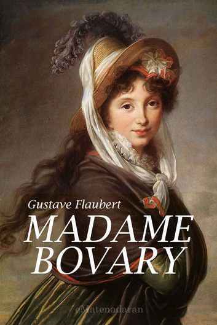

# Les thèmes de l'oeuvre

Madame Bovary est un roman qui aborde de nombreux thèmes, explorant le caractère humain et les comportements sociétaux.

Les thèmes principaux du roman sont :
1. L'amour
2. L'adultère
3. La fiction comme échappatoire
4. La désillusion
5. La critique sociale

# L'amour

Dans Madame Bovary, l’amour est présenté comme un sentiment fortement influencé par les rêves et les illusions d’Emma. Elle ne cherche pas seulement à aimer : elle veut vivre un amour exceptionnel, passionné et romanesque, semblable à ceux qu’elle a découverts dans ses lectures. Son mariage avec Charles ne correspond donc pas à ses attentes, car Charles est un homme simple, affectueux mais peu passionné. Emma ressent alors progressivement de l’ennui et de la frustration. À travers son personnage, Flaubert montre ainsi le décalage entre l’amour rêvé et l’amour réel. Emma poursuit constamment une passion idéale, mais aucune relation ne parvient à satisfaire durablement ses attentes.

# L'adultère

L’adultère constitue un élément central du roman et représente pour Emma une manière de fuir son mariage et son quotidien. Elle entretient d’abord une relation avec Rodolphe, puis avec Léon. Ces relations lui donnent l’impression de vivre enfin la passion dont elle rêve. Cependant, elles ne lui apportent qu’un bonheur temporaire et finissent elles aussi par provoquer la déception. L’adultère apparaît donc comme une fausse solution à son mal-être. Flaubert ne présente pas seulement Emma comme une femme infidèle : il montre également les conséquences de ses choix, notamment les mensonges, les souffrances et les difficultés financières qui s’accumulent. L’adultère participe ainsi à la progression d’Emma vers sa ruine.

# La fiction comme échappatoire

La fiction joue un rôle essentiel dans la personnalité d’Emma. Depuis sa jeunesse, elle lit des romans sentimentaux qui lui donnent une vision idéalisée de l’amour, de la passion et de la vie. Ces lectures deviennent pour elle une véritable échappatoire : elles lui permettent d’imaginer une existence plus belle que celle qu’elle mène réellement. Cependant, Emma finit par confondre la fiction avec la réalité. Elle cherche à reproduire dans sa propre vie les situations extraordinaires qu’elle a découvertes dans les livres. Ses relations avec Rodolphe et Léon sont notamment influencées par cette vision romanesque de l’amour. Flaubert montre ainsi que la fiction peut faire rêver, mais qu’elle peut aussi créer des attentes impossibles à satisfaire lorsque le lecteur ne parvient plus à distinguer le rêve de la réalité.

# La désillusion

La désillusion est l’un des thèmes les plus importants du roman. Emma imagine constamment une vie idéale, mais la réalité ne correspond jamais à ses rêves. Son mariage, ses amants, sa vie sociale et même ses projets de fuite finissent par la décevoir. Chaque fois qu’elle pense avoir trouvé le bonheur, celui-ci disparaît rapidement. Cette répétition crée un cercle de l’espoir et de la déception : Emma rêve, obtient quelque chose, puis découvre que cela ne suffit pas. Sa désillusion devient de plus en plus profonde jusqu’à la fin du roman. Flaubert montre ainsi les conséquences d’une insatisfaction permanente : Emma ne parvient jamais à accepter la réalité telle qu’elle est et cherche toujours ailleurs ce qui pourrait la rendre heureuse.

# La critique sociale

À travers l’histoire d’Emma, Flaubert propose également une critique de la société bourgeoise du XIXᵉ siècle. Il décrit un monde dominé par les apparences, l’argent, les conventions sociales et la médiocrité. Les personnages de Yonville, comme le pharmacien Homais, représentent notamment une bourgeoisie sûre d’elle-même, attachée à son statut et à ses idées. Flaubert critique aussi la place limitée accordée aux femmes : Emma dispose de peu de possibilités pour échapper au rôle d’épouse et de mère que la société lui impose. L’argent occupe également une place importante : poussée par son désir d’une vie luxueuse, Emma accumule les dettes auprès de Lheureux, ce qui contribue finalement à sa chute. Le roman constitue donc une critique de la bourgeoisie, des conventions sociales et du matérialisme de son époque.

[Retour aux personnages](perso.md)

[Retour aux lieux de l'oeuvre](lieux.md)

[Retour à la page principale](index.md)
